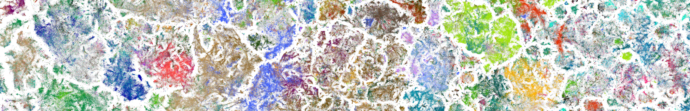

# About {.page-title}

  

# About me

I'm a PhD candidate in the Hertie Institute for AI in Brain Health at the University of Tübingen. I build machine learning methods that turn large, messy datasets into representations people can explore and reason about.

I fine-tune transformer-based LLMs to produce text embeddings that capture semantic meaning, and I adapt dimensionality reduction methods like _t_-SNE and UMAP to scale to millions of data points. I used these methods to build a map of 21 million biomedical publications. This map reveals trends in how research fields grow and change over time.

I'm interested in bringing that same skill set to applied, industry-scale problems. This means turning large amounts of high-dimensional data into something usable, and using LLMs and agents to help solve real-world tasks.

I'm currently on the job market for **machine learning engineer / applied scientist** roles in industry, starting autumn.

## Education

  

    <h3>PhD  Machine Learning</h3>
    
2022 - present

    
Berens Lab, Hertie Institute for AI in Brain Health

    
International Max Planck Research School on Intelligent Systems

    
University of Tübingen

  

  

    <h3>MSc Neural Information Processing 
</h3>
    
2019 - 2021

    
University of Tübingen

    
International Max Planck Research School

  

  

    <h3>BSc Physics</h3>
    
2015 - 2019

    
University of Sevilla

    
University of Münster

  

  

    <h3>BSc Materials Engineering</h3>
    
2015 - 2018

    
University of Sevilla

    
parallel studies, not finished

  

## Skills

  

    <h3>Machine learning</h3>
    
NLP · LLMs · Agents · Text embeddings · RAG systems · Retrieval · Self-supervised learning · Contrastive learning · Neighbor embedding · Visualization methods

  

  

    <h3>Technical skills</h3>
    
Python · PyTorch · scikit-learn · Matplotlib · uv · Git + GitHub · Docker · LaTeX

  

  

    <h3>Languages</h3>
    
Spanish (native)

    
English (proficient)

    
German (advanced knowledge)

  

