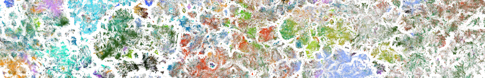

# CV {.page-title}

  

# Curriculum Vitae

  <a class="btn btn-accent" href="../files/CV_Rita_Gonzalez_Marquez.pdf">Download PDF</a>

<!-- TODO: add your CV PDF at docs/files/CV_Rita_Gonzalez_Marquez.pdf and update the link above.
     Below is an optional on-page summary — keep it in sync with the PDF, or remove it and rely
     on the download button only. -->

<!-- ## Experience

**PhD Candidate, Machine Learning** — University of Tübingen (Kobak / Berens Lab)
[start year] – present

- [Key contribution or result]
- [Key contribution or result]

**[Previous role]** — [Organization]
[years]

- [Key contribution or result]

## Education

**PhD, Machine Learning** — University of Tübingen, [start year]–present

**[MSc, field]** — [University], [years]

**[BSc, field]** — [University], [years]

## Technical skills

Python · PyTorch · scikit-learn · pandas / numpy · SQL · Git · [add more]

## Selected publications

See the [Publications](publications.en.md) page for the full list. -->
