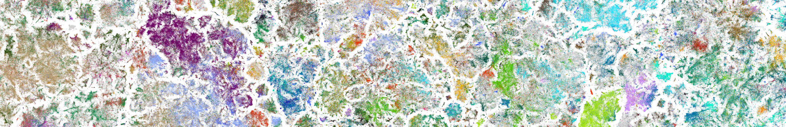

# Projects {.page-title}

  

# Projects

  

    <h3>PubMed Landscape</h3>
    
A 2D atlas of 21M+ biomedical abstracts built from text embeddings, used to study the
    emergence of research fields and the dynamics of COVID-19 research.

    
Python · BERT embeddings · t-SNE

    
<a href="https://github.com/berenslab/pubmed-landscape">View on GitHub →</a>

    
<a href="https://static.nomic.ai/pubmed.html">Interactive visualization →</a>

    
<a href="https://www.machinelearningforscience.de/en/navigating-20-million-papers-at-once-to-uncover-knowledge/">Blogpost →</a>

  

    

    <h3>LLM Excess Vocabulary</h3>
    
Detecting the fingerprints of LLM-assisted writing across 15M+ biomedical abstracts by
    tracking shifts in word usage over time.

    
Python · NLP · Large-scale text analysis

    
<a href="https://github.com/berenslab/llm-excess-vocab">View on GitHub →</a>

    
<a href="https://www.economist.com/science-and-technology/2024/06/26/at-least-10-of-research-may-already-be-co-authored-by-ai">Cover by The Economist →</a>

    
<a href="https://epaper.zeit.de/webreader-v3/index.html#/949331/35">Cover by Die Zeit →</a>

  

  

    <h3>Text Visualizations</h3>
    
An SBERT-based projector trained end-to-end with a contrastive, t-SNE-like InfoNCE loss,
    producing 2D text embeddings that double as both a good visualization and a good sentence
    embedding.

    
Python · PyTorch · Sentence Transformers · InfoNCE · Dimensionality reduction

    
<a href="https://github.com/ritagonmar/text-visualizations">View on GitHub →</a>

  

  

    <h3>Cropping vs. Dropout: Text Embedding Augmentation</h3>
    
Companion code for our TMLR paper comparing self-supervised fine-tuning strategies for
    text embedding models, showing that cropping-based augmentation outperforms dropout.

    
Python · PyTorch · Sentence Transformers · Contrastive learning

    
<a href="https://github.com/berenslab/text-embed-augm">View on GitHub →</a>

  

  

    <h3>LLM Readability</h3>
    
Quantifying how LLM-assisted writing has changed the readability of biomedical abstracts
    published between 2010 and 2025.

    
Python · NLP · LLMs

    
<a href="https://github.com/ritagonmar/llm-readability">View on GitHub →</a>

  

  

    <h3>ICLR Dataset</h3>
    
An open dataset of 24k+ ICLR submission abstracts (2017-2024) with decisions and
    keyword-based labels, used to study trends in machine learning research.

    
Python · NLP · Dataset curation

    
<a href="https://github.com/berenslab/iclr-dataset">View on GitHub →</a>

  

