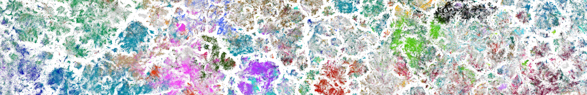

# Publications {.page-title}

  

# Publications

  
Most biomedical publications show signs of LLM-assisted writing

  
Lena Holzwarth, Rita González-Márquez, Dmitry Kobak · In review, 2026

  

    <a href="https://arxiv.org/pdf/2608.10715">Paper</a>
    <a href="https://github.com/kobaklab/llm-usage-in-pmc">Code</a>
  

  

    
Abstract

    Over the past several years, LLM-powered chatbots and agents have become widely used as a tool for academic writing. LLM-assisted writing can be valuable by removing language barriers but at the same time causes concerns about misconduct and fraud. To inform policy decisions, it is necessary to monitor the prevalence of LLM-altered texts in scholarly publications. Despite some recent progress in this direction, no existing method can produce reliable estimates. Here we suggest and validate a new unbiased approach to estimate LLM usage in a corpus of texts based on changing word frequencies. We apply our method to the full texts of open-access biomedical papers from Pubmed Central, and show that by the end of 2025, 89% of papers show excess of LLM-associated vocabulary. We also find that LLMs are twice as likely to be used when writing a paragraph in the Discussion section (68%) compared to a paragraph in the Methods section (32%), but even inside the Methods section, the overall prevalence of LLM usage is over 50%. We believe that our estimates are crucial to shape future guidelines and policies.
  

  
Cropping outperforms dropout as an augmentation strategy for training self-supervised text embeddings

  
Rita González-Márquez, Philipp Berens, Dmitry Kobak · Transactions on Machine Learning Research, 2026

  

    <a href="https://arxiv.org/pdf/2508.03453">Paper</a>
    <a href="https://github.com/berenslab/text-embed-augm">Code</a>
  

  

    
Abstract

    Text embeddings, i.e. vector representations of entire texts, play an important role in many NLP applications, such as retrieval-augmented generation, clustering, or visualizing collections of texts for data exploration. Currently, top-performing embedding models are derived from pre-trained language models via supervised contrastive fine-tuning. This fine-tuning strategy relies on an external notion of similarity and annotated data for generation of positive pairs. Here we study self-supervised fine-tuning and systematically compare the two most well-known augmentation strategies used for fine-tuning text embeddings models. We assess embedding quality on MTEB and additional in-domain evaluations and show that cropping augmentation strongly outperforms the dropout-based approach. We find that on out-of-domain data, the quality of resulting embeddings is substantially below the supervised state-of-the-art models, but for in-domain data, self-supervised fine-tuning can produce high-quality text embeddings after very short fine-tuning. Finally, we show that representation quality increases towards the last transformer layers, which undergo the largest change during fine-tuning; and that fine-tuning only those last layers is sufficient to reach similar embedding quality.
  

  
Delving into LLM-assisted writing in biomedical publications through excess vocabulary

  
Dmitry Kobak, Rita González-Márquez, Emőke-Ágnes Horvát, Jan Lause · Science Advances, 11(27):eadt3813, 2025

  

    <a href="https://www.science.org/doi/full/10.1126/sciadv.adt3813">Paper</a>
    <a href="https://github.com/berenslab/llm-excess-vocab">Code</a>
  

  

    
Abstract

    Large language models (LLMs) like ChatGPT can generate and revise text with human-level performance. These models come with clear limitations, can produce inaccurate information, and reinforce existing biases. Yet, many scientists use them for their scholarly writing. But how widespread is such LLM usage in the academic literature? To answer this question for the field of biomedical research, we present an unbiased, large-scale approach: We study vocabulary changes in more than 15 million biomedical abstracts from 2010 to 2024 indexed by PubMed and show how the appearance of LLMs led to an abrupt increase in the frequency of certain style words. This excess word analysis suggests that at least 13.5% of 2024 abstracts were processed with LLMs. This lower bound differed across disciplines, countries, and journals, reaching 40% for some subcorpora. We show that LLMs have had an unprecedented impact on scientific writing in biomedical research, surpassing the effect of major world events such as the COVID pandemic.
  

  
The landscape of biomedical research

  
Rita González-Márquez, Luca Schmidt, Benjamin M. Schmidt, Philipp Berens, Dmitry Kobak · Patterns, p. 100968, 2024

  

    <a href="https://www.cell.com/patterns/fulltext/S2666-3899(24)00076-X">Paper</a>
    <a href="https://github.com/berenslab/pubmed-landscape">Code</a>
  

  

    
Abstract

    The number of publications in biomedicine and life sciences has grown so much that it is difficult to keep track of new scientific works and to have an overview of the evolution of the field as a whole. Here, we present a two-dimensional (2D) map of the entire corpus of biomedical literature, based on the abstract texts of 21 million English articles from the PubMed database. To embed the abstracts into 2D, we used the large language model PubMedBERT, combined with t-SNE tailored to handle samples of this size. We used our map to study the emergence of the COVID-19 literature, the evolution of the neuroscience discipline, the uptake of machine learning, the distribution of gender imbalance in academic authorship, and the distribution of retracted paper mill articles. Furthermore, we present an interactive website that allows easy exploration and will enable further insights and facilitate future research.
  

  
Learning representations of learning representations

  
Rita González-Márquez, Dmitry Kobak · ICLR 2024 Workshop on Data-centric Machine Learning Research (DMLR): Harnessing Momentum for Science, 2024

  

    <a href="https://openreview.net/pdf?id=2OObXL3AaZ">Paper</a>
    <a href="https://github.com/berenslab/iclr-dataset">Code</a>
  

  

    
Abstract

    The ICLR conference is unique among the top machine learning conferences in that all submitted papers are openly available. Here we present the ICLR dataset consisting of abstracts of all 24 thousand ICLR submissions from 2017--2024 with meta-data, decision scores, and custom keyword-based labels. We find that on this dataset, bag-of-words representation outperforms most dedicated sentence transformer models in terms of NN classification accuracy, and the top performing language models barely outperform TF-IDF. We see this as a challenge for the NLP community. Furthermore, we use the ICLR dataset to study how the field of machine learning has changed over the last seven years, finding some improvement in gender balance. Using a 2D embedding of the abstracts' texts, we describe a shift in research topics from 2017 to 2024 and identify hedgehogs and foxes among the authors with the highest number of ICLR submissions.
  

  
Two-dimensional visualization of large document libraries using t-SNE

  
Rita González-Márquez, Philipp Berens, Dmitry Kobak · ICLR 2022 Workshop on Geometrical and Topological Representation Learning, 2022

  

    <a href="https://openreview.net/pdf?id=Hebl3EZ16lq">Paper</a>
    <a href="https://github.com/berenslab/pubmed-tsne-iclr">Code</a>
  

  

    
Abstract

    We benchmarked different approaches for creating 2D visualizations of large document libraries, using the MEDLINE (PubMed) database of the entire biomedical literature as a use case (19 million scientific papers). Our optimal pipeline is based on log-scaled TF-IDF representation of the abstract text, SVD preprocessing, and t-SNE with uniform affinities, early exaggeration annealing, and extended optimization. The resulting embedding distorts local neighborhoods but shows meaningful organization and rich structure on the level of narrow  academic fields.
  

  <a href="https://scholar.google.com/citations?user=RAfipNgAAAAJ&hl=es&oi=ao">See full list on Google Scholar →</a>

